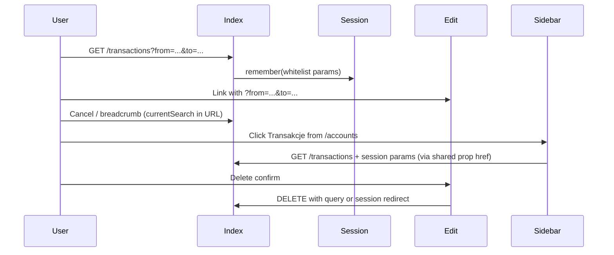

# Transactions Index Filters Persistence — Design Spec

**Date:** 2026-06-02  
**Status:** Approved (brainstorming)  
**Scope:** C (in-app navigation + sidebar + backend redirects)

## Problem

On `transactions/Index`, filters live in the URL query string. Partial client support (`currentSearch`) propagates query params to Edit/Create links and Cancel, but several paths drop filters:

- Breadcrumb „Transakcje” on Edit/Create uses hardcoded `/transactions`
- Sidebar „Transakcje” always links to the current calendar month
- Backend redirects after `store`, `destroy`, transfer create, and import commit use bare `to_route('transactions.index')`
- Delete from the index table relies on server redirect without filter context

Users expect the list to return to the same filtered view after editing, saving, deleting, or navigating away via the sidebar.

## Goals

1. Preserve index filters when returning from Edit/Create via Cancel or breadcrumb.
2. Preserve the last index filter state when opening Transactions from the sidebar after visiting other app pages.
3. Preserve filters on backend redirects to `transactions.index` after create, delete, transfer create, and import commit.
4. After „Wyczyść filtry”, treat the cleared state as the remembered state (sidebar links to unfiltered list with default sort).

## Non-Goals

- Persisting filters across browser sessions / devices (scope D — no `localStorage` longevity requirement).
- Changing `update` redirect (stays on Edit).
- Restoring pagination `page` on write redirects (always land on page 1).
- Import history or unrelated domains.

## Decisions (from brainstorming)

| Topic | Decision |
|---|---|
| Scope | C: A + B + backend redirects |
| Primary mechanism | Laravel session + Inertia shared prop |
| Secondary mechanism | Append saved query string to Inertia mutation URLs (POST/PUT/DELETE) |
| Sidebar default (no session) | Current month range (existing behavior) |
| After clear filters | Session stores cleared state; sidebar matches |
| Page on write redirect | Omitted (page 1) |

---

## Allowed Query Parameters

Whitelist only (security + predictable redirects):

| Key | Source | Notes |
|---|---|---|
| `account_id` | `TransactionIndexRequest::getFilters()` | nullable int |
| `from` | filters | `d-m-Y` |
| `to` | filters | `d-m-Y` |
| `sort` | `getData()` | `date` \| `amount` |
| `direction` | `getData()` | `asc` \| `desc` |
| `per_page` | `getData()` | `15` \| `25` \| `50` \| `100` |

**Not stored for redirects:** `page` (reset on write operations).

---

## Backend

### `App\Support\Transactions\TransactionsIndexQuery`

Stateless helper around session key `transactions.index.query` (array of whitelisted keys).

| Method | Behavior |
|---|---|
| `remember(Request $request): void` | Extract whitelisted keys from request (only non-empty / validated values), write to session |
| `params(): array` | Read session array; empty array if never set |
| `toQueryString(): string` | Build `?key=value&...` or `''` if no params |
| `redirect(): RedirectResponse` | `to_route('transactions.index', $this->params())` |

**Remember trigger:** `TransactionController@index` after `TransactionIndexRequest` validation — pass merged filter + index data (excluding `page`) from the request, or call `remember()` with the request directly and let the helper filter keys.

**Redirect call sites:**

- `TransactionController@store`
- `TransactionController@destroy`
- `TransferController@store` (redirect to transactions index)
- `ImportController` — all `to_route('transactions.index')` success/error paths that return to the list

### Inertia shared data

In `HandleInertiaRequests::share()`:

```php
'transactionsIndexSearch' => fn () => TransactionsIndexQuery::toQueryString(),
```

Available on every authenticated Inertia page for sidebar and forms without `currentSearch` in the URL.

---

## Frontend

### Composable: `useTransactionsIndexSearch()`

Location: `resources/js/composables/useTransactionsIndexSearch.ts`

| Export | Behavior |
|---|---|
| `currentSearch` | `page.url` query slice (`?...` or `''`) |
| `transactionsIndexSearch` | `currentSearch` if non-empty, else `page.props.transactionsIndexSearch` |
| `transactionsIndexHref` | `route('transactions.index') + transactionsIndexSearch` |
| `defaultMonthSearch()` | Existing sidebar month range query (unchanged logic, moved or imported) |

### UI changes

| File | Change |
|---|---|
| `AppSidebar.vue` | Transactions `href` = `transactionsIndexHref` from composable, fallback `defaultMonthSearch()` when both empty |
| `transactions/Edit.vue` | Breadcrumb index link → `transactionsIndexHref` |
| `transactions/Create.vue` | Breadcrumb index link → `transactionsIndexHref` |
| `transfers/Create.vue` | Breadcrumb index link → `transactionsIndexHref` |
| `transactions/Create.vue` | `form.post(route('transactions.store') + transactionsIndexSearch)` |
| `transactions/Edit.vue` | `form.put(... + transactionsIndexSearch)`; keep `onDeleted` visit with search |
| `DeleteTransactionDialog.vue` | Optional prop `returnSearch`; append to `form.delete` URL |
| `transactions/Index.vue` | Pass `returnSearch` to delete dialog; breadcrumb can stay `/transactions` (user is already on index) |

Remove duplicate `currentSearch` computed blocks where replaced by composable.

---

## Data Flow



---

## Error Handling

- Invalid / stale `account_id` in session: existing `TransactionIndexRequest` validation fails; Laravel returns validation errors on index (current behavior).
- Empty session: sidebar uses current-month default; redirects use empty params (unfiltered index with server defaults for sort/per_page).

---

## Testing

Feature tests under `tests/Feature/Transactions/`:

1. **Session remember:** `GET transactions.index` with filter query → assert session contains keys.
2. **Store redirect:** Authenticated `POST store` after visiting filtered index → `assertRedirect` to index URL containing `from` / `account_id`.
3. **Destroy redirect:** `DELETE` after filtered index visit → redirect preserves filters.
4. **Clear filters:** `GET index` with only `sort`/`direction` → session updated → next redirect has no date/account params.

Optional: assert Inertia shared prop in a middleware test if trivial.

Run: `php artisan test --compact --filter=TransactionsIndex` (or specific file).

---

## Implementation Notes

- Run `vendor/bin/pint --dirty` on touched PHP files.
- Follow Variant A architecture: helper in `Support/Transactions/`, no new `Services/` root.
- Do not change `TransactionController@update` redirect target.

---

## Acceptance Criteria

- [ ] Index with filters → Edit → breadcrumb „Transakcje” → same filters visible
- [ ] Index with filters → Edit → Cancel → same filters
- [ ] Index with filters → Accounts → sidebar Transakcje → same filters
- [ ] Create → Save → index shows same filters as before create
- [ ] Edit → Delete → index shows same filters
- [ ] Index → Delete row → index shows same filters
- [ ] Clear filters → sidebar Transakcje → unfiltered list (default sort)
- [ ] First visit (no prior index in session) → sidebar still opens current month
