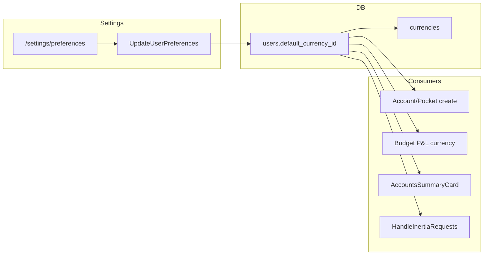

# Default currency (user preference) — design spec

**Status:** Approved in brainstorming (2026-06-06)  
**Builds on:** goals currency (`.docs/superpowers/specs/2026-06-05-goals-currency-design.md`)  
**Canonical requirements target:** `.docs/prd.md`  
**Next step:** Implementation plan (`.docs/superpowers/plans/`)

## Summary

Each user has a **default (main) currency** stored as `users.default_currency_id`. The preference lives on a new **Settings → Preferences** page (`/settings/preferences`). It drives:

1. Pre-selection in create forms (accounts, pockets)
2. Budget P&L currency (monthly and yearly views)
3. Global formatting where no entity-specific currency applies (e.g. `AccountsSummaryCard`, Inertia shared data)

Existing accounts and pockets keep their own `currency_id` when the user changes the main currency. **No FX conversion** in this iteration — cross-currency aggregation remains intentionally incomplete until a future FX feature.

## Problem

Today the app hardcodes PLN in several places (`BudgetCurrency::pln()`, `AccountsSummaryCard` filters `code === 'PLN'`, create forms default to `currencies[0]`). There is no user-level preference. As multi-currency accounts arrive, users need an explicit “main currency” for defaults and P&L presentation, with future FX converting summaries to that currency.

## Decisions log

| Topic | Decision |
|-------|----------|
| Storage | `users.default_currency_id` FK → `currencies`, NOT NULL |
| Settings UI | New page `/settings/preferences` (Settings nav: Profile · **Preferences** · Password · Appearance) |
| MVP dropdown | Same currency list as account create (seeded currencies; MVP = PLN only) |
| Change behaviour | Affects **new** entities + P&L/budget formatting only; **no migration** of existing accounts/pockets |
| FX / conversion | **Out of scope** — no exchange rates; aggregated cross-currency totals not converted |
| Budget pocket section | Unchanged — per-pocket `row.currency` (entity currency) |
| Transaction/account lists | Unchanged — each row shows its entity currency |
| Registration | `default_currency_id` = PLN on `RegisteredUserController` and `user:create` |
| Existing users | Migration backfill → PLN |
| Shared frontend access | `auth.user.default_currency` in `HandleInertiaRequests` |

## Data model

### User (updated)

| Field | Type | Description |
|-------|------|-------------|
| `default_currency_id` | FK → `currencies`, NOT NULL | User's main currency; mutable via Preferences |

### Relations

`User` belongs to `Currency` as `defaultCurrency`.

### Migration

1. Add `default_currency_id` nullable on `users`.
2. Backfill all users → PLN (`currencies.code = 'PLN'`).
3. Set NOT NULL + FK constraint.

## Backend

### Domain: Settings

| Layer | File / class |
|-------|----------------|
| Controller | `Http/Controllers/Settings/PreferencesController` |
| Request | `Http/Requests/Settings/UpdatePreferencesRequest` |
| Action | `Actions/Settings/UpdateUserPreferences` |

**Routes** (`routes/settings.php`):

- `GET settings/preferences` → `preferences.edit`
- `PATCH settings/preferences` → `preferences.update`

### UpdatePreferencesRequest

- `default_currency_id`: required, `exists:currencies,id`

No validation blocking change when user has accounts/pockets in other currencies.

### UpdateUserPreferences Action

```php
public function handle(User $user, array $validated): void
```

Updates `default_currency_id` only.

### BudgetCurrency refactor

Replace `BudgetCurrency::pln()` with user-aware resolver:

```php
public static function forUser(User $user): array
// returns { code, symbol, precision }
```

Used by `ListMonthlyBudget::getCurrency()`, `ListYearlyBudget::getCurrency()`, and any P&L aggregation that currently calls `BudgetCurrency::pln()`.

### Create form defaults

- `AccountController::create` — pass `default_currency_id` from authenticated user (frontend pre-selects over `currencies[0]`)
- `PocketController::create` — same

### HandleInertiaRequests

Eager-load `defaultCurrency` on shared `auth.user`:

```php
'default_currency' => CurrencyResource::make($user->defaultCurrency)->resolve($request),
```

(Only when user is authenticated.)

### Registration / CLI

- `RegisteredUserController::store` — set `default_currency_id` to PLN id
- `Auth/CreateUser` command — same

## Frontend

### Settings → Preferences (`resources/js/pages/settings/Preferences.vue`)

- `SettingsLayout` wrapper (same pattern as Profile)
- Currency dropdown (`DropdownSelect`) — options from `currencies` prop
- PATCH to `route('preferences.update')` with toast on success
- Helper text: main currency used for new accounts/pockets and budget P&L formatting

### Settings nav

Add item in `layouts/settings/Layout.vue`:

```ts
{ title: t('settings.nav.preferences'), href: '/settings/preferences' }
```

### Create forms

- `accounts/Create.vue` — `initialCurrencyId` from `default_currency_id` prop (fallback `currencies[0]`)
- `pockets/Create.vue` — same

### AccountsSummaryCard

- Filter accounts by `user.default_currency.code` instead of hardcoded `'PLN'`
- Use `default_currency.symbol` for formatted total
- i18n: rename `accounts.summary.totalPln` → `accounts.summary.totalMainCurrency` with `{currency}` interpolation
- Empty state when no accounts in main currency

### Global fallback

Replace `t('currency.defaultSymbol')` with `auth.user.default_currency.symbol` where the context is “app main currency” (not entity-specific). Entity-specific displays (account row, transaction list per account) keep entity currency.

## Error handling

| Scenario | Behaviour |
|----------|-----------|
| Invalid `default_currency_id` on PATCH | 422 validation error |
| No accounts in main currency | Summary card empty state with CTA |
| Unauthenticated access to preferences | Redirect to login (`auth` middleware) |
| Missing PLN in seed during migration | Migration fails (fail-fast) |

## Telemetry

| Event | Context |
|-------|---------|
| `user_default_currency_updated` | `{ old_code, new_code }` on successful PATCH |

## Testing

### Feature — Settings (`tests/Feature/Settings/PreferencesUpdateTest.php`)

- GET preferences page renders current currency and currency list
- PATCH updates `users.default_currency_id`
- PATCH with invalid id → 422
- Changing default does **not** alter existing account `currency_id`

### Feature — integration

- Account create form receives `default_currency_id` matching user preference
- Monthly budget `currency` prop matches user default (not hardcoded PLN)
- Migration backfills existing users to PLN

### Unit

- `BudgetCurrency::forUser()` returns correct shape for user with PLN default

## i18n keys

| Key | Purpose |
|-----|---------|
| `settings.nav.preferences` | Settings sidebar |
| `settings.preferences.title` | Page title |
| `settings.preferences.description` | Page description |
| `settings.preferences.fields.default_currency.label` | Field label |
| `settings.preferences.toast.updated` | Success toast |
| `accounts.summary.totalMainCurrency` | Summary label with `{currency}` |
| `accounts.summary.countMainCurrency` | Account count in main currency |

## Out of scope (this iteration)

- Exchange rates and FX conversion
- Cross-currency aggregated totals with conversion
- Multiple currencies in UI beyond seeded set (MVP: PLN only in dropdown)
- Auto-migration of existing accounts/pockets when main currency changes
- Blocking main currency change when user has data in other currencies
- Per-locale number format changes based on currency (keep `pl-PL` locale)

## Future (not this spec)

When FX lands:

- Summaries (accounts total, budget cross-currency) convert all amounts to `users.default_currency_id`
- `AccountsSummaryCard` includes all accounts, converted
- `BudgetCurrency::forUser()` remains the presentation currency for P&L

## PRD follow-up (post-implementation)

- Add FR in §6 Settings: user default currency preference
- Remove “per-user default currency” from out-of-scope in `2026-06-05-goals-currency-design.md` §Out of scope

## Architecture


